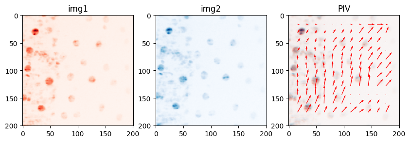

# multi_quickPIV

I am restructuring quickPIV to make it more modular and ease the integration of parallelized PIV (multithreaded PIV and CPU+GPU PIV). 

## Installation
```
using Pkg;
Pkg.add(url="https://github.com/Marc-3d/multi_quickPIV.git")
```

## Usage example
The code snippet below shows how to run a PIV analysis with ```multi_quickPIV``` and how to retrieve the U and V components of the resulting PIV vector field. NOTE: The input images should be of type `Float64` or `Float32`, preferably `Float64` to avoid precision errors. 
```julia
    using multi_quickPIV

    # A) Running PIV between two images with default parameters
    VF, SN = multi_quickPIV.PIV( img1, img2 )

    # B) Running PIV between two images with custom parameters
    
    # B.1) Creating a "parameters object" with custom values
    pivparams = multi_quickPIV.setPIVParameters( interSize=(32,32), searchMargin=(16,16), step=(16,16), threshold=1000 )
    
    # B.2) Providing the parameters as the last argument to the PIV function
    VF, SN = multi_quickPIV.PIV( img1, img2, pivparams )
```

```VF``` contains the output vector field, and ```SN``` contains a signal-to-noise measure for each vector of the vector field. ```VF``` is an (N+1)-D array, which stores the U, V and W components of the PIV vector field. This is how to extract the individual components from ```VF```: 

```julia
    # 2D PIV
    U = VF[ 1, :, : ]; 
    V = VF[ 2, :, : ]; 

    # 3D PIV
    U = VF[ 1, :, :, : ]; 
    V = VF[ 2, :, :, : ]; 
    W = VF[ 3, :, :, : ];
```

Example of a 2D PIV result generated with multi_quickPIV on biological data: 



I always visualize the input images using different colors, so that I can overlay them to visually appreciate the underlying translations of the structures between the images. 


<details> 
 
<summary> Loading images --- code example </summary>

<br>

The code snippet below exemplifies how to extract two images from a 2D+t TIF dataset with [LIBTIFF.jl](https://github.com/Marc-3d/LIBTIFF.jl.git).

```julia
    using LIBTIFF

    # Provide a valid filename
    filename = raw"C:\Users\Marc-3d\Data\cells_maxprojection.tif"
    maxprojections = tiffread( filename )

    # Extracting two consecutive timepoints from the array of max projections
    timepoint1 = 28; 
    timepoint2 = 29; 
    img1 = Float64.( maxprojections[ 400:600, 300:500, timepoint1 ] ); 
    img2 = Float64.( maxprojections[ 400:600, 300:500, timepoint2 ] ); 
```
</details>

<br> 

<details> 

<summary> Visualizing PIV results --- code example </summary>

<br>

This is the code to generate the previous figure, with the two input images and the PIV results: 

```julia
    using PyPlot

    # computing the coordinates of each vector (interrogation area) on the 
    # input image
    vfsize = size( U )
    step   = multi_quickPIV._step( pivparams )[1:2]
    isize  = multi_quickPIV._isize( pivparams )[1:2]
    xgrid  = [ (x-1)*step[2] + div(isize[2],2) for y in 1:vfsize[1], x in 1:vfsize[2] ];
    ygrid  = [ (y-1)*step[1] + div(isize[1],2) for y in 1:vfsize[1], x in 1:vfsize[2] ];

    begin 
        subplot( 1, 3, 1 ); 
            title("img1"); 
            imshow( img1, cmap="Reds" ); 
        subplot( 1, 3, 2 ); 
            title("img2"); 
            imshow( img2, cmap="Blues" ); 
        subplot( 1, 3, 3 ); 
            title("PIV" ); 
            imshow( img1, cmap="Reds" ); 
            imshow( img2, alpha=0.5, cmap="Blues" );
            quiver( xgrid, ygrid, V, -1 .* U, color="red", scale=50 ); 
    end
```

</details>
